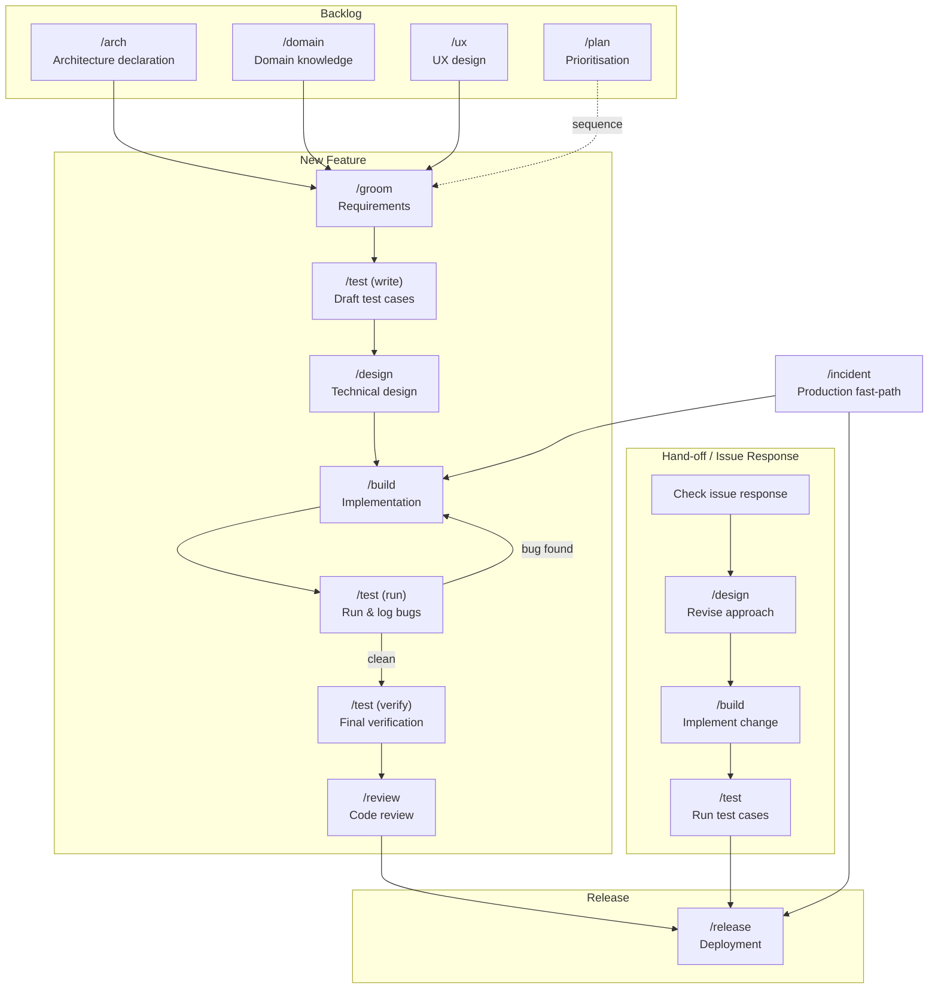

# pai-orbit · v1.10.0

A structured developer methodology harness for Claude Code, Cursor, GitHub Copilot, and OpenAI Codex (beta) — installed as a plugin in Claude Code and Cursor, and with one command for Copilot and Codex.

pai-orbit gives your project a shared vocabulary for how work gets done — distinct modes for building, designing, planning, and exploring data; operational skills for git, task management, and deployment; and a first-time setup that generates everything project-specific from a short conversation.

> **This repository is a Claude Code marketplace.** The pai-orbit plugin lives at [`plugins/pai-orbit/`](plugins/pai-orbit/). The marketplace currently lists this one plugin; additional plugins can be added alongside it.

## What it is

Software teams waste context constantly: half-designed features get built, build sessions derail into planning debates, agronomic (or domain) questions get answered with guesses. pai-orbit imposes a light discipline: **each slash command puts Claude into a distinct headspace with a defined output destination.** Switching is explicit. Outputs are saved. Nothing important lives only in a conversation.

```
Backlog
/arch            → architecture declaration — produces docs/architecture/ (system, constraints, stack)
/domain          → domain knowledge — produces docs/domain/
/ux              → user flow and layout design — produces docs/features/*/ux.md

Sprint — recommended order for a new feature
/groom           → feature requirements — produces docs/features/*/requirements.md; asks for a ticket number,
                   reasons about product context, confirms scope, then scenarios → requirements; readiness gate
                   blocks /design until functional gaps are closed; at session close: posts open questions to
                   board, commits file, offers card move and push
/test (write)    → draft test cases from requirements before any code is written — produces docs/features/*/test-plan.md
/design          → technical trade-offs — produces docs/decisions/ and docs/features/*/design.md
/build           → implementation — sets up a branch first; builds only groomed, design-resolved issues;
                   reads docs and constraints, checks task board, ships
/test (run)      → execute test plan; log failures to docs/wip/
/build           → fix logged bugs; repeat test → build until clean
/test (verify)   → final verification pass; confirm all acceptance criteria are met
/review          → code review — checks diff against constraints, CLAUDE.md, ADRs, requirements
/review security → OWASP Top 10 security pass — injection, auth, authz, secrets, input, deps, crypto, cloud/IAM

Release
/release         → guided deployment with preflight checks and post-deploy health verification

Production fast-path
/incident        → triage → BUILD → REVIEW → RELEASE → post-mortem

Hand-off / issue response
check issue      → read response or reviewer feedback
/design          → revise approach if needed — updates design.md or creates a new ADR
/build           → implement the change
/test            → run relevant test cases; log any failures
/release         → ship once the test pass is clean

Workflow skills (callable from any mode)
/git             → commit, branch, PR — reads project branching model
/board           → task creation, card movement, team assignment (GitHub Issues, GitHub Projects v2, Linear, Jira, GitLab, Azure DevOps)
/analysis        → change impact and dependency analysis
/data-model      → schema reference and migration management
/simplify        → code simplification — remove over-engineering, dead code, abstractions

Planning and maintenance
/plan            → roadmap and prioritisation — consumes docs, moves board cards
/data            → read-only data exploration (SELECT only) — produces docs/reports/
/epic            → epic lifecycle — create, load, update, and list epics in docs/epics/
/setup           → first-time configuration — generates config, agents, hooks, docs scaffold
/suggest-skills  → discover recurring patterns worth encoding as project skills (extends Claude's built-in)
```

## Mode flow



Workflow skills (`/git`, `/board`, `/analysis`, `/data-model`, `/simplify`) can be invoked from any phase.

> **`/groom` readiness gate** — before handing off to `/design`, `/groom` audits every open question and classifies it as a *functional gap* (what the system does — must be resolved) or a *design question* (how it does it — deferred to `/design`). The feature is not marked groomed until all functional gaps are closed. This prevents half-specified features from entering design.

> **`/review security`** — the security-focused pass is a sub-mode of `/review`. Use `/review` for full code review, `/review security` for the OWASP checklist, or `/review full` for both in sequence. Critical and High findings block merge.

> **Migrating to v1.10.0 — modes now move their own ticket.** `/groom`, `/design`, `/build` and `/review` move the ticket at close-out using a `## Mode transitions` map that `/setup` writes.
> - Re-run `/setup` once — it adds `## Mode transitions` to `.claude/pai-orbit-config.md` (existing sections untouched).
> - Until you do, those modes finish normally and print: "No mode-transition map — re-run /setup to enable automatic board moves."
> - `/build` no longer closes the issue; it moves it (e.g. to In review). The issue closes on merge via `closes #N`.
> - `/review` never moves the issue to Done by default. Done comes from the merge (your board's merge automation or `closes #N`). If your board has an "Approved" or "Ready to merge" column, an approving review moves the issue there.
> - GitHub Projects: run `gh auth refresh -s project` if moves fail with a permission error.

> **v1.9.0 — `/groom` checks other consumers of an existing signal.** When a change alters how an existing field, flag, or derived value is read, `/groom` Phase 2 now searches the code (and every declared, locally available repo) for other places that read it, plus an optional `docs/domain/concept-consumers.md` map, and proposes each one as a candidate scenario. The outcome is shown every session and recorded under a new `## Consumer check` section that the session-close audit enforces — so re-grooming a feature whose older `requirements.md` has no such section will return to Phase 2 until it is added. `/groom` also now reads `docs/architecture/constraints.md`. Update pai-orbit to pick it up (see [Updating](#updating)).

> **v1.8.0 — `system_docs_repo` now redirects writes, not just reads.** Every mode/skill/agent that writes to `docs/` now resolves the target through a new shared `reference/docs-path-resolution.md`, shipped with every adapter (inlined into each prompt and skill for Copilot and Codex). If you installed pai-orbit before v1.8.0, update it (see [Updating](#updating)) to pick up both the new `reference/` directory and the fix — until then, `system_docs_repo` writes keep landing in the local repo instead of the configured docs repo.

## Install

### Claude Code (full fidelity)

```bash
# Add the marketplace straight from GitHub
/plugin marketplace add the-psi/pai-orbit

# Install the plugin
/plugin install pai-orbit@the-psi
```

That's it — Claude Code fetches the repo and resolves the plugin from the marketplace listing. The listing points at `plugins/pai-orbit/dist/claude-code/`, which is the committed, built artifact produced by `plugins/pai-orbit/adapters/claude-code/build.sh`. No clone needed for installation.

If you're developing against a local checkout instead:

```bash
git clone https://github.com/the-psi/pai-orbit
/plugin marketplace add /absolute/path/to/pai-orbit
/plugin install pai-orbit@the-psi
```

### Cursor (plugin — recommended)

Install as a **user-level or team marketplace** plugin (rules, skills, commands, agents, hooks):

| Path | How to install |
|------|----------------|
| Repo root (`.cursor-plugin/marketplace.json`) | Paste `https://github.com/the-psi/pai-orbit` in Cursor — installs `dist/cursor-plugin/pai-orbit/` |
| [`plugins/pai-orbit/dist/cursor-plugin/pai-orbit/`](plugins/pai-orbit/dist/cursor-plugin/pai-orbit/) | Symlink or copy to `~/.cursor/plugins/local/pai-orbit` |

See [`docs/cursor-plugin-install-and-usage.md`](docs/cursor-plugin-install-and-usage.md) and [`plugins/pai-orbit/dist/cursor-plugin/README.md`](plugins/pai-orbit/dist/cursor-plugin/README.md).

**Do not** use the legacy copy-rules install and the plugin together — duplicate mode rules will conflict.

### GitHub Copilot (VS Code)

Copilot users get real invokable slash commands (`/groom`, `/design`, `/build`, `/git`, …) — 29 prompts (14 modes, 6 skills, 7 service-builder agents, 2 named agents: `/docs-writer` and `/cross-repo-impact`) plus 5 auto-attaching instructions files. Install with one command from the project root:

```bash
npx github:the-psi/pai-orbit init copilot
```

This installs the pai-orbit files only. Then run `/setup` in Copilot Chat (Business/Pro tier runs it agentically, proposing file edits you accept). Copilot Free users can pass `--setup` to run the full interview from the terminal instead: `npx github:the-psi/pai-orbit init copilot --setup`. The setup step renders `.copilot/pai-orbit-config.md`, `.copilot/team.md`, `AGENTS.md`, and scaffolds `docs/`. Full adoption guide: [`docs/copilot-install-and-usage.md`](docs/copilot-install-and-usage.md).

**Enforcement is honest:** Copilot has no runtime hook system, so `bash-guard` intent lives as advisory text in `.github/copilot-instructions.md` (Copilot usually obeys); the optional `.husky/pre-commit` adds commit-time lint + weak secret detection, but cannot block `git push --force` or `git add -A`. Details in the adoption page's Hook coverage matrix.

### OpenAI Codex CLI (beta)

Codex users get a native install — 20 skills (6 operational, 14 modes), 2 subagents (`docs-writer`, `cross-repo-impact`), 4 hooks with PowerShell versions for Windows, MCP, and always-on rules. Requires Codex CLI v0.144.6+ and Node.js 18+. Install with one command from the project root:

```bash
npx github:the-psi/pai-orbit init codex
```

Modes are invoked as `$build`, `$groom`, and so on; `plan` and `review` are renamed `$orbit-plan` and `$orbit-review` so they don't clash with Codex's built-in `/plan` and `/review`. After installing, open `codex`, trust the project, run `/hooks` and trust the 4 hooks, then run `$setup`.

**Existing projects:** `init codex` refuses to run if `AGENTS.md`, `README.md`, or `.codex/` already exist. `update codex` installs anyway but overwrites them with no backup, so commit first and restore your settings afterwards (see [Updating](#updating)). Full guide: [`docs/codex-install-and-usage.md`](docs/codex-install-and-usage.md).

### Other coding assistants (lossy)

The same plugin source is compiled to per-tool bundles under `plugins/pai-orbit/dist/`.

| Tool | Path | How to install |
|------|------|----------------|
| Cursor (legacy) | [`plugins/pai-orbit/dist/cursor/`](plugins/pai-orbit/dist/cursor/) | Copy `.cursor/` into your project root — use only if you cannot install the plugin |

See [`plugins/pai-orbit/README.md`](plugins/pai-orbit/README.md) for adapter internals and how to rebuild the bundles.

## Updating

| Tool | How to update |
|------|---------------|
| Claude Code | `/plugin marketplace update the-psi`, then in `/plugin` → **Installed** → `pai-orbit` → **Update now**, then `/reload-plugins`. From a shell: `claude plugin marketplace update the-psi`, then `claude plugin update pai-orbit@the-psi`. Third-party marketplaces don't auto-update by default. |
| Cursor plugin | Reinstall or refresh the plugin from `https://github.com/the-psi/pai-orbit`, then reload Cursor. |
| GitHub Copilot | `npx github:the-psi/pai-orbit update copilot` — refreshes pai-orbit files and keeps your `.copilot/` config and `AGENTS.md`. |
| OpenAI Codex CLI | Commit first, then run `npx github:the-psi/pai-orbit update codex`. It overwrites `AGENTS.md`, `README.md`, and everything in `.codex/`, which resets your config, team file, and lint hook repo paths. Keep the newly installed files, and merge back only your project-specific content: restore your own `README.md`, re-add your project sections to the new `AGENTS.md`, and re-enter your config, team, and lint repo paths (or run `$setup`). Then re-trust the hooks with `/hooks`. |
| Cursor (legacy) | Copy `.cursor/` from [`plugins/pai-orbit/dist/cursor/`](plugins/pai-orbit/dist/cursor/) again. |

After updating Claude Code or the Cursor plugin, re-run `/setup` in each project to pick up new templates and config sections. It only changes what's new.

## First run

After installing, run `/setup` in your project directory. It will:

1. Discover your repo structure and tech stack
2. Ask a short set of questions (task board, branching model, deployment, docs home, team, architecture)
3. **Query your live board for its actual column/state taxonomy** — no typing label names by hand:
   - **GitLab**: queries project boards first; presents the board list so you pick which one(s) define your workflow; derives column→label order directly from the board's lists. Falls back to querying all labels only if no boards are configured.
   - **GitHub Projects v2**: runs `gh project field-list` to read Status field options
   - **Linear**: runs `linear team list` to read workflow states
   - **Azure DevOps**: checks Azure CLI, its `azure-devops` extension, and project access; confirms the team's area path and work-item type; discovers work-item states and asks you to confirm their board-column mapping and closing state. Failed or empty state discovery falls back to a manual mapping. Azure settings apply only to Azure boards.
   - **Jira / GitHub Issues / Notion**: prompts you to enter column names manually
4. Generate `.claude/pai-orbit-config.md`, `.claude/team.md`, a `CLAUDE.md` stub, stack-specific agents, a `docs/` scaffold, and a `docs/architecture/` stub
5. Create `.claude/hooks/`, write all safety hook scripts, wire them into `.claude/settings.json`, and validate each hook path — with a clear recovery message if anything is missing
6. Tell you exactly what to fill in by hand

Then run `/arch init` to complete your architecture declaration — a guided interview that writes `docs/architecture/system.md` (service map), `constraints.md` (enforcement rules), and `stack.md`. Once declared, `/build` reads the constraints before generating code and `/review` checks every diff against them.

For a step-by-step Azure test using a disposable work item, see [Azure Boards verification](docs/azure-boards-verification.md).

Re-run `/setup` anytime the stack, board configuration, or team changes significantly. The column→label table in `.claude/pai-orbit-config.md` includes a `# Re-run /setup` comment as a reminder when board labels drift.

## Agents

Two built-in agents ship with pai-orbit; `/setup` generates additional stack-specific agents for your project.

| Agent | Role |
|-------|------|
| `docs-writer` | Writes and updates docs locally; syncs outbound to Confluence/Notion via MCP |
| `cross-repo-impact` | Read-only — searches configured repos for usages of a changed interface and classifies each as breaking, compatible, or unknown |
| Stack agents | One agent per service (FastAPI, Next.js, Django, Express, React/Vite, IaC, generic), generated by `/setup`. Each works only inside its service directory and runs tests before claiming completion. |

> **`/board` — GitLab label resolution**: before any column move, `/board` resolves the target label live against the project's label list. If the configured label is missing it blocks and prints the full label listing — it never guesses or silently uses a wrong label. Stale-but-found labels proceed with a warning so work is not interrupted while labels are being renamed.

## Hooks

Four shell hooks are included. Wire them in Claude Code's settings or copy them to `.claude/hooks/` in your project (done automatically by `/setup`).

| Hook | Event | What it does |
|------|-------|--------------|
| `bash-guard.sh` | PreToolUse | Blocks `git push --force`, bulk staging (`git add .`/`-A`), `--no-verify`, and unsafe `rm` on root/home |
| `lint-python.sh` | PostToolUse | Runs `ruff check` after any `.py` edit. Advisory — never blocks. |
| `lint-ts.sh` | PostToolUse | Runs `eslint --max-warnings 0` after any `.ts`/`.tsx` edit. Advisory — never blocks. |
| `arch-drift-guard.sh` | PostToolUse | Prints an advisory nudge when structural files (`docker-compose.yml`, `package.json`, `go.mod`, etc.) are edited. Suggests `/arch validate`. Never blocks. |

## Docs

- [Process & Practices](docs/process-and-practices.md) — the methodology: why modes, working style, how sessions should flow
- [Capabilities](docs/capabilities.md) — reference for every mode, skill, and agent
- [Getting Started](docs/getting-started.md) — installation, first `/setup` walkthrough, first session
- [Cursor plugin install and usage](docs/cursor-plugin-install-and-usage.md)
- [Copilot install and usage](docs/copilot-install-and-usage.md)
- [Codex install and usage](docs/codex-install-and-usage.md)

## Philosophy

**Producer/consumer.** `/arch` produces the architecture contract. `/domain` produces science. `/groom` produces requirements. `/design` produces feature-level architecture. `/build` produces code. `/plan` consumes all of the above to decide what to work on next. Switch modes when the headspace or output destination changes.

**Local-first docs.** All modes write markdown locally. If your team uses Confluence or Notion, `docs-writer` handles outbound sync. Local is Claude's working copy; the remote platform is the published surface. Edits should flow outward, not inward — bidirectional sync creates conflicts that are hard to resolve cleanly.

**Config over baked-in.** Modes contain methodology, not project specifics. Board URLs, branch naming conventions, deployment targets, and team handles all live in `.claude/pai-orbit-config.md` and `.claude/team.md`. `/setup` generates those; the modes read them.

## License

MIT
