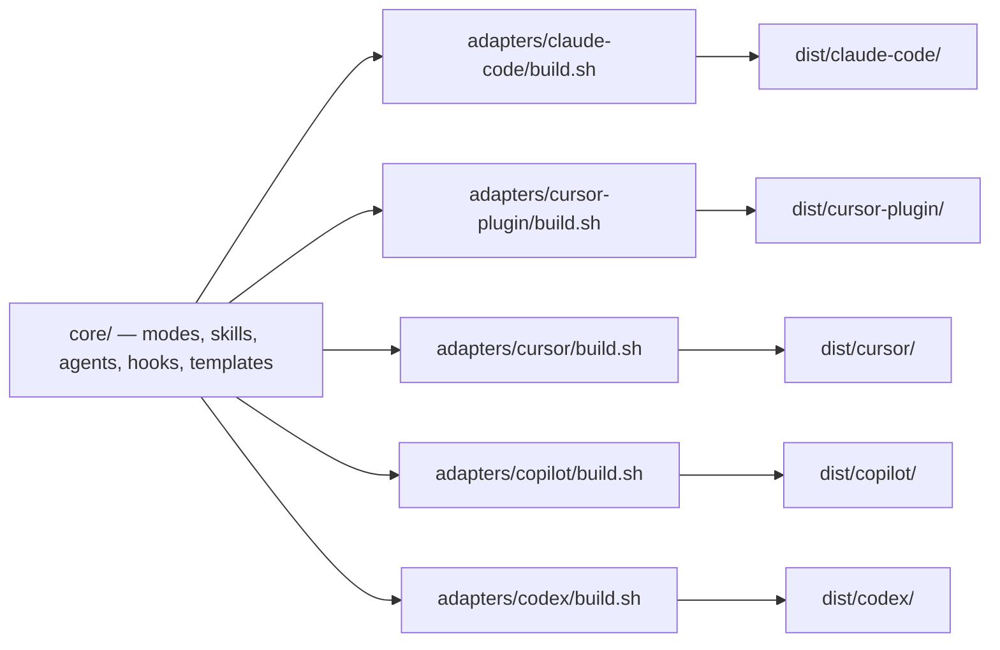

# System Architecture: pai-orbit
Last updated: 2026-07-24
Status: declared

## Services

| Service | Path / Repo | Stack | Purpose |
|---------|-------------|-------|---------|
| core | `plugins/pai-orbit/core/` | Markdown (modes/skills/agents) + bash (hooks) | Tool-agnostic source of truth for all modes, skills, agents, hooks, templates |
| claude-code adapter | `plugins/pai-orbit/adapters/claude-code/` → `dist/claude-code/` | bash build script | Full-fidelity compile of core to the Claude Code plugin format |
| cursor-plugin adapter | `plugins/pai-orbit/adapters/cursor-plugin/` → `dist/cursor-plugin/` | bash build script | Cursor plugin (rules, skills, commands, agents, hooks) |
| cursor adapter (legacy) | `plugins/pai-orbit/adapters/cursor/` → `dist/cursor/` | bash build script | Lossy `.cursor/rules/*.mdc` compile |
| copilot adapter | `plugins/pai-orbit/adapters/copilot/` → `dist/copilot/` | bash build script | Lossy `.github/copilot-instructions.md` compile |
| codex adapter | `plugins/pai-orbit/adapters/codex/` → `dist/codex/` | bash build script | Experimental `AGENTS.md` compile |

## Communication

| From | To | Protocol | Notes |
|------|----|----------|-------|
| top-level `build.sh` | each `adapters/*/build.sh` | shell invocation | Discovers and runs every adapter automatically |
| adapter build.sh | `core/` | filesystem read | Reads `${CORE_DIR:-../../core}` |
| adapter build.sh | `dist/<tool>/` | filesystem write | Writes `${DIST_DIR:-../../dist/<tool>}`, which is committed |

## Data Stores

None — this is a static content pipeline (markdown/bash in, markdown/bash out). No database, cache, or queue.

## Data Flow

## System Boundaries

**Inside this system:** `core/`, `adapters/*/`, `dist/*/`, and `docs/` in this repo.

**Outside this system (not owned, treated as external):**
- The Claude Code host application/runtime that loads the plugin
- GitHub (Issues, Projects v2) — used as the board, not owned by this repo
- The Claude Code plugin marketplace mechanism (`marketplace.json` resolution)
- Consuming target-project repos — they install `dist/claude-code/` (or another adapter's bundle) and generate their own `.claude/` config via `/setup`; this repo has no visibility into or control over that generated config

## Open Questions

- [ ] `constraints.md` rule 6 requires full adapter parity, but `cursor` (legacy) is documented as "lossy" and `codex` as "experimental" today — both are known to fall short. Bring them to parity, or revisit the rule. — owner: unassigned
