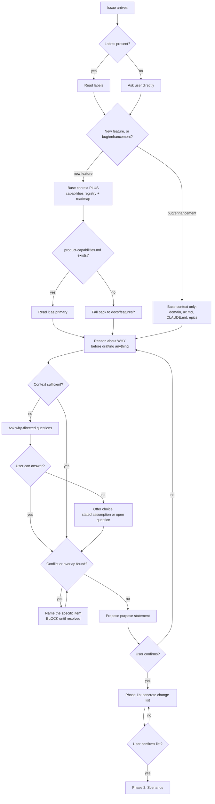

# Design: `/groom` product-context reasoning (Phase 1)

**Date:** 2026-08-18
**Issue:** [#35](https://github.com/the-psi/pai-orbit/issues/35) — "Groom should have domain knowledge"
**Requirements:** [requirements.md](./requirements.md) (status: Groomed — ready for /design)
**Branch:** `feat/groom-product-context`
**Status:** Built and verified — in review as [PR #62](https://github.com/the-psi/pai-orbit/pull/62)
**Blocked on:** nothing. All 8 build tasks are complete.

> **D1 was overtaken on 2026-09-03.** Build task 7 (rebuild `dist/`) was gated on PRs
> [#34](https://github.com/the-psi/pai-orbit/pull/34) and
> [#51](https://github.com/the-psi/pai-orbit/pull/51) merging. Neither could be merged, and
> the feature shipped ahead of them by decision. The rebuild then showed D1's stated cost did
> not exist: it touches 14 files, **none** under `dist/copilot/` or `dist/codex/`, because
> those adapters drop `## Session flow` — so it adds no conflict surface to either PR. What
> remains is the parity gap itself: `copilot` and `codex` ship `/groom` without this feature
> until those PRs land. See
> [ADR 2026-09-03](../../decisions/2026-09-03-ship-groom-phase1b-ahead-of-adapter-parity.md)
> and [test-plan.md](./test-plan.md).

---

## Inputs read

| Source | Why |
|--------|-----|
| `docs/features/groom-product-context/requirements.md` | 15 REQs / 12 ACs, 6 scenarios |
| `plugins/pai-orbit/core/modes/groom.md` (164 lines) | The single file this behaviour lives in |
| `docs/architecture/system.md` | Service boundaries; open question on adapter parity |
| `docs/architecture/constraints.md` | Rules 6 (parity) and 7 (dist compat) both bind here |
| `CLAUDE.md` | Producer/consumer contract, key design principles |
| All six `adapters/*/build.sh` | To establish real mode fidelity per adapter |
| Committed `dist/` output on PR branches #34 and #51 | To check claimed parity against actual emitted files |
| ADR 2026-07-24 adapter-parity-and-dist-compat | Lineage for the parity decision |
| ADR 2026-08-03 product-capabilities-placement-rule | Names `/groom` as a consumer of the capabilities registry |
| ADR 2026-08-18 add-kiro-power-adapter | Sixth adapter, merged mid-design; accepted agent/hook gap |

No `## System Docs` section exists in `.claude/pai-orbit-config.md`, so no external doc
resolution was attempted.

---

## Problem restated

`/groom` Phase 1 today draws purpose from three sources in precedence order (epic
`## Summary`, `ux.md`, domain docs) and — if it can draft something — proposes it for
confirmation. Two defects follow from that shape:

1. **Draft-then-confirm.** The current wording ("If purpose can be drafted from these,
   propose it and confirm") permits a plausible paraphrase of the issue title to pass as
   purpose. Nothing forces reasoning about *why* before drafting.
2. **No product context.** Audience, roadmap position, existing capabilities, and
   conflicts with in-flight work are not consulted at all. `/groom` can produce complete,
   testable requirements for work that is already shipped, already planned elsewhere, or
   serves no documented user.

---

## Decisions

### D1 — No adapter work; sequence the rebuild after PRs #34 and #51

**Decided:** this feature requires **no adapter changes**. Edit `core/modes/groom.md` only,
and defer the `dist/` rebuild until PRs #34 (copilot) and #51 (codex) have merged.

**How this decision changed.** An earlier draft of this design proposed extending
`emit_mode_summary()` in the `copilot` and `codex` adapters, on the reasoning that both drop
every mode's `## Session flow` section — where all 15 of this feature's requirements live —
and that constraint 6 would therefore block the merge. That reasoning was correct about
`main` and wrong about reality: it was drawn from `main` and the branch tips without checking
what the open PRs do to those files. Both PRs delete `emit_mode_summary()` outright and
replace it with full-mode-text emission. The proposed ADR has been withdrawn rather than
recorded, since it was never committed.

Measured fidelity across all six adapters, verified against committed `dist/` output rather
than PR titles:

| Adapter | Mode compilation | `## Session flow` present | Work needed |
|---------|-----------------|---------------------------|-------------|
| `claude-code` | `cp -R` full tree | Yes | None |
| `cursor-plugin` | `cat` + frontmatter | Yes | None |
| `cursor` (legacy) | `cat` + frontmatter | Yes | None |
| `kiro-power` | `cat "$mode_file"` | Yes — 14 phase refs in `skills/groom-mode.md` | None |
| `copilot` | `emit_mode_summary()` on `main` | No on `main`; **yes** on PR #34 — 14 phase refs in `.github/prompts/groom.prompt.md` | None, once #34 merges |
| `codex` | `emit_mode_summary()` on `main` | No on `main`; **yes** on PR #51 — 14 phase refs in `.agents/skills/groom/SKILL.md` | None, once #51 merges |

So four of six adapters already carry phase logic, and the remaining two are fixed by work
already in review. Constraint 6 is satisfied by merge order, not by new code.

**Sequencing consequence.** A `dist/` rebuild now would regenerate `dist/copilot/` and
`dist/codex/` in their current (pre-PR) layouts. PR #34 rewrites 53 `dist/` files and PR #51
rewrites 96, so rebuilding before they land creates hand-resolved conflicts in committed
build output for no benefit. The `core/modes/groom.md` edit itself is conflict-free — neither
PR touches that file.

**Correction to prior records.** `constraints.md` rule 6 and ADR 2026-07-24 both name
`cursor` (legacy) and `codex` as the adapters below the parity bar. For *mode* fidelity that
is inaccurate: `cursor/build.sh` emits full mode text via `cat`, and is lossy only for agents
and hooks, which it drops outright per its own header comment. On `main` the pair that loses
mode session-flow is **`copilot` and `codex`** — and both are being fixed. Rule 6's inline
note was refreshed on 2026-08-18 by the kiro-power ADR but still carries the same
mis-attribution. Correcting it is an `/arch` task — see Open questions.

### D2 — Roadmap sources merge with per-field precedence

**Decided:** the board is authoritative for **status, ownership, and existence**;
`docs/plans/*.md` is authoritative for **sequencing rationale**. Neither wins outright.
Recorded as [ADR 2026-08-18-groom-roadmap-source-precedence](../../decisions/2026-08-18-groom-roadmap-source-precedence.md).

This answers the open question the requirements deferred to `/design`.

The two sources answer different questions, so a single global precedence rule discards
real information either way. A genuine contradiction — the board says shipped, a plan says
next quarter — is a REQ-5 conflict: name both items and block, do not silently pick one.

**The degraded path is mandatory, not optional.** During this design session the board was
unreachable: the `gh` token carries `gist, read:org, repo, workflow`, and Projects v2 needs
`read:project`. `/groom` must therefore treat board unavailability as an expected state —
proceed on `docs/plans/*.md` alone, state in-session that the board was not consulted, and
record that under `## Context`. It must not fail, and must not silently drop the caveat.

### D3 — Capabilities registry is the primary overlap source

**Decided:** REQ-10's overlap check reads `docs/domain/product-capabilities.md` first,
falling back to `docs/features/*` when it is absent.

The requirements were written 2026-07-25. ADR 2026-08-03 landed after, and its Consequences
state that "`/plan`, `/groom`, and `/domain` can trust `product-capabilities.md` to answer
'what does this product do today'." `/build` now carries a standing obligation to maintain
that file. REQ-10 and the `## Context` note justifying it ("No canonical product
capabilities doc exists") are both stale and need amending — see Open questions.

The fallback is not hypothetical: this repo's own `docs/domain/` contains only `.gitkeep`,
so the fallback path is what executes here.

### D4 — The scope gate stays inside Phase 1; phases are not renumbered

**Decided:** the Scenario-6 scope gate becomes **Phase 1b**, a second gate within Phase 1.
Phase 2 remains scenarios; Phase 3 remains requirements.

The requirements describe it as "a new phase gate between Phase 1 and Phase 2", which reads
two ways. The deciding evidence is the requirements' own vocabulary: REQ-12 says "before any
scenarios are proposed **in Phase 2**" and REQ-14 says "before `/groom` proceeds to **Phase
2**". Both fix Phase 2 = scenarios. Promoting the scope gate to Phase 2 would contradict the
requirements that describe it, and would additionally churn every announce string, the
pre-flight audit, and AC-10's wording. Phase 1b satisfies the intent — an explicit,
confirmed gate before scenarios — at no cost to internal consistency.

---

## Designed Phase 1 flow

### Requirement coverage

| Step in flow | Requirements satisfied |
|---|---|
| Classify via labels, ask when absent | REQ-11, AC-9 |
| Conditional context depth by classification | REQ-9, REQ-10, AC-7, AC-8 |
| Capabilities registry primary, features fallback | REQ-10 (as amended by D3) |
| Reason before drafting | REQ-1, REQ-2, AC-1, AC-2 |
| Why-questions on sparse context | REQ-3, REQ-4, AC-3 |
| Assumption-vs-open-question fallback | REQ-7, REQ-8, AC-6 |
| Name the conflicting item, block | REQ-5, REQ-6, AC-4, AC-5 |
| Phase 1b change list + explicit confirm | REQ-12, REQ-13, REQ-14, AC-10, AC-12 |
| `## Scope` section placement | REQ-15, AC-11 |

All 15 REQs and 12 ACs map to a step. No orphans.

### The edit that carries the most risk

REQ-2 ("reason first, do not draft-then-confirm") is the hardest to express as instruction
text, because the current wording actively permits the wrong behaviour. The fix is not an
added sentence but a **replacement** of Phase 1 step 2's conditional ("If purpose can be
drafted from these, propose it and confirm"). Leaving that clause in place while appending a
reasoning step would leave two contradictory instructions in one phase, and the cheaper one
tends to win. This is the single most important edit in the feature.

---

## Build tasks

Implementation belongs to `/build`. Sequenced:

1. `core/modes/groom.md` — replace Phase 1 step 2's draft-then-confirm clause; add the
   classification step, conditional context set, reasoning-before-drafting requirement,
   why-question behaviour, conflict-naming and blocking, and assumption/open-question
   fallback.
2. `core/modes/groom.md` — add the Phase 1b scope gate with explicit confirmation.
3. `core/modes/groom.md` `## Behaviour` — add the new read set (`docs/domain/*.md`,
   `docs/domain/product-capabilities.md`, `docs/plans/*.md`, board) with D2's precedence
   and the board-unreachable degraded path.
4. `core/modes/groom.md` `## Output format` — add `## Scope` between `## Purpose` and
   `## Scenarios in scope`.
5. `core/modes/groom.md` `## Session close` — extend the pre-flight audit to check
   `## Scope` consistency alongside `## Purpose` and `## Scenarios in scope`.
6. Amend `requirements.md` REQ-10 and `## Context` per D3.
7. **After PRs #34 and #51 merge** — `bash plugins/pai-orbit/build.sh` to rebuild all six
   adapters; review the `dist/` diff. Deferred per D1, not optional: `dist/` is committed,
   so the feature is not shipped until it is regenerated.
8. `core/plugin.json` — version bump, synced with `README.md` and `CLAUDE.md` version
   references.

Steps 1–5 are one file and should land together. Step 6 is a separate, groomed artifact.

**No adapter build scripts are edited.** Per D1, all six adapters either already emit full
mode text or are fixed by PRs already in review.

**On the version bump:** constraint 7 mandates one only when an adapter's `dist/` output
*shape* changes. This feature changes mode content, not structure, so rule 7 is not strictly
triggered. It is still listed because `constraints.md` → Cross-cutting Standards says the
plugin version "should be bumped alongside README/CLAUDE.md references on every meaningful
change," and a new phase gate in `/groom` qualifies. Migration note is not required.

### Verification

No test harness exists in this repo, so verification is by inspection plus a live exercise:

- After the deferred rebuild, `git diff` under `dist/` shows the new Phase 1 / Phase 1b text
  in all six adapters' groom output, and no structural change to any of them.
- Run `/groom` against a **bug-labelled** issue; confirm roadmap/board consultation is
  skipped (AC-7).
- Run `/groom` against a **new-feature** issue; confirm capabilities and roadmap are
  consulted and cited (AC-8).
- Run `/groom` in this repo, where `docs/domain/` holds only `.gitkeep`, to exercise the
  sparse-context path (AC-3) and D3's fallback.

---

## Risks

| Risk | Severity | Mitigation |
|------|----------|-----------|
| Contradictory instructions left in Phase 1 (append instead of replace) | High — silently defeats REQ-2, the core of the issue | Treat build task 1 as a replacement; call it out in review |
| Rebuild runs before PRs #34/#51 merge, creating `dist/` conflicts | Medium | D1 defers the rebuild; build task 7 is explicitly gated on those merges |
| Feature merges with the rebuild still deferred, so `dist/` lags `core/` | Medium | `dist/` is committed and is what consumers install — build task 7 is a ship blocker, not a follow-up |
| Board unreachable in most sessions (token scopes) | Medium — this was the live condition today | D2's degraded path is mandatory behaviour, not a nicety |
| Phase 1 cost grows for trivial issues | Low | REQ-9 classification gate keeps bug fixes on the base context set |

---

## Open questions

- [ ] `constraints.md` rule 6 and ADR 2026-07-24 name `cursor`/`codex` as the sub-parity
      adapters; for mode fidelity it is `copilot`/`codex`, and both are fixed by PRs #34/#51.
      Rule 6's note was refreshed 2026-08-18 but kept the mis-attribution. Correct both
      records. — owner: `/arch`
- [ ] `system.md` documents `kiro-power` correctly (service row plus its own open question),
      but its first open question still frames the parity gap as `cursor` "lossy" and `codex`
      "experimental". For modes that framing is wrong and, once PRs #34/#51 merge, obsolete.
      Restate it against the remaining real gap: agents and hooks, not modes. — owner: `/arch`
- [ ] `requirements.md` REQ-10 and `## Context` are stale per D3 and need amending. Doing
      this from `/design` edits a groomed artifact — confirm whether `/groom` should own it.
      — owner: Chetan Sharma
- [ ] Should D2's precedence rule also bind `/plan`, which reads both roadmap sources? Out
      of scope for #35, but the same ambiguity exists there. — owner: `/plan`

---

## Not designed here

Per the requirements' `## Out of scope`: Phase 3 product-context reasoning, populating
`docs/domain` / `docs/plans` / `ux.md` content, and changes to any other mode's behaviour.
D2 raises a question for `/plan` but proposes no change to it.
