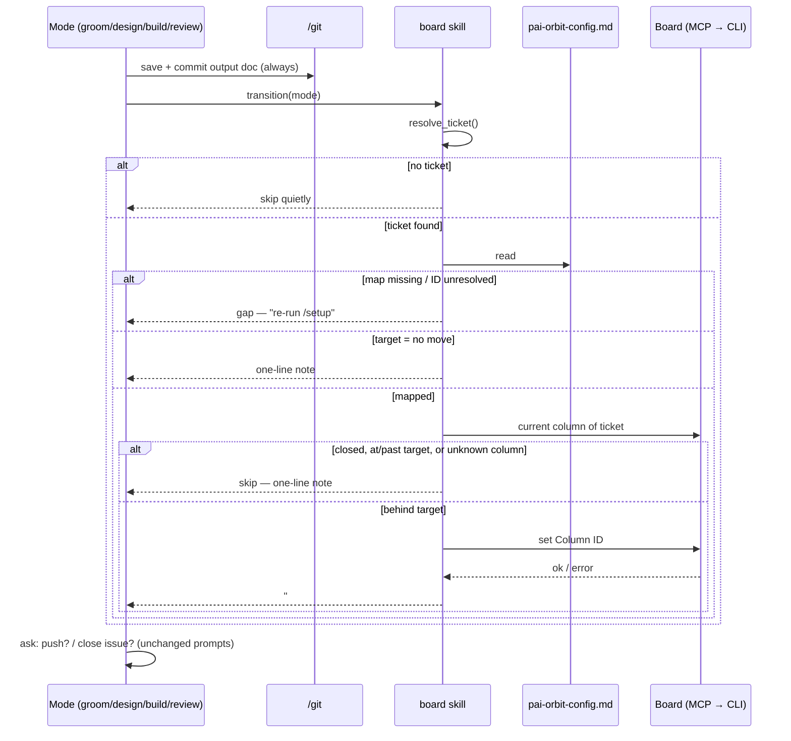

# Design: Mode transitions — automatic board moves at mode close-out

**Date:** 2026-10-01
**Issue:** [#30](https://github.com/the-psi/pai-orbit/issues/30) — "/setup should generate a mode→board-status transition map and make status transitions a compulsory part of each mode's close-out"
**Requirements:** [requirements.md](./requirements.md) (status: Groomed — ready for /design)
**Branch:** `feat/mode-transitions`
**ADR:** [2026-10-01-mode-transitions-map-and-board-transition.md](../../decisions/2026-10-01-mode-transitions-map-and-board-transition.md)
**Status:** Designed — ready for /build
**Target version:** 1.10.0

---

## Inputs read

| Source | Why |
|--------|-----|
| `docs/features/mode-transitions/requirements.md` | 10 scenarios, 17 REQs, 14 ACs, design questions D1–D7 |
| Issue #30 body + comments | Original proposal; the requesting team's hand-written `## Mode transitions` stopgap |
| `docs/architecture/constraints.md` | Rule 6 (full adapter parity), rule 7 (dist backward compatibility) |
| `docs/architecture/system.md` | Boards (GitHub Projects etc.) are external systems, not owned here |
| `core/skills/board/SKILL.md` | Existing create / move / close ops; "MCP vs shell" rule; GitHub Projects "drag in browser" advice |
| `core/modes/setup.md` Step 2b / Step 3 | Existing per-board column discovery; config generation |
| `core/templates/pai-orbit-config.md.template` | Where the new section must also appear (REQ-3) |
| `core/modes/{groom,design,build,review}.md` | Current close-outs being changed |
| All five `adapters/*/build.sh` | How each adapter carries skills, modes and setup into `dist/` |

**Impact analysis gate:** no `analysis-*.md` exists for this feature. Judged **additive** — a new
config section and a new board-skill operation; no existing section or operation changes shape.
Blast radius grepped: six modes carry an "Offer to move?" step; only groom, design, build and
review change (ux, test, arch, domain unchanged per Scope).

---

## Problem restated

Modes know which document they produce but not which board column the ticket should move to.
Close-out moves are opt-in prompts with a loosely described target ("the Groomed or
backlog-ready column"), so tickets drift: a feature can be designed and still sit in Backlog.
`/setup` already discovers the board's columns but never maps modes to them, and on GitHub
Projects the board skill tells people to drag cards in the browser.

---

## Decisions

Each decision was taken one at a time with the user in the design session of 2026-10-01.

### ① Config layout and ID storage (D1, D7)

**Decision:** a standalone `## Mode transitions` section in `.claude/pai-orbit-config.md`
(and in `core/templates/pai-orbit-config.md.template`): a short board-IDs header plus a
three-column table `| Mode | Target column | Column ID |`. `no move` is a valid target.
The existing `## Agile Board → columns` table is **not** changed.

**D7 — align with the requesting team:** yes. Their hand-written table (Mode | Status | Option ID)
has the same three-column shape. `transition()` reads the table **by column position**
(mode, target name, ID), not by header text, so their table works unmodified; re-running
`/setup` rewrites it with canonical headers while keeping rows (REQ-14).

```markdown
## Mode transitions
<!-- Generated by /setup from the live board. Re-run /setup if the board changes. -->
<!-- Read by the board skill's transition(mode). Target "no move" = leave the ticket where it is. -->

Board IDs (GitHub Projects v2):
- Project ID: PVT_kwDO...
- Status field ID: PVTSSF_lADO...

| Mode   | Target column | Column ID |
|--------|---------------|-----------|
| groom  | Ready         | 61e4505c  |
| design | no move       | —         |
| build  | In review     | df73e18b  |
| review | no move       | —         |
```

What "Column ID" holds per board type:

| Board type | Board IDs header | Column ID | Notes |
|------------|------------------|-----------|-------|
| GitHub Projects v2 | Project node ID, Status field ID | Status single-select **option ID** | From `gh project field-list --format json` (field `id`, option `id`) |
| Linear | Team ID | Workflow **state ID** | |
| Jira | Project key | **Status ID** | Jira moves via *transitions*, which depend on the current status — `transition()` resolves the transition to the target status at move time |
| GitLab | — | Column **label name** | GitLab columns are labels; the existing label-resolution step applies |
| GitHub Issues / Notion / none | — | — | No column concept to move. Setup writes every row as `no move` and says why |

Options rejected: IDs added to the existing columns table (changes a shared table every mode
reads; doesn't match the requesting team's format); names only, resolved live (contradicts
REQ-3/AC-1, catches renames only at move time).

### ② How the move is performed (D2)

**Decision:** `transition(mode)` is a **board-agnostic contract** in the board skill. Each step
runs through the configured board MCP first and falls back to the CLI under the skill's
existing "MCP vs shell" rule. Each board type gets one short CLI fallback recipe. For mode
close-out moves, the "GitHub Projects — drag in the browser" advice no longer applies.

The point of saving IDs in config is that **both** MCP and CLI moves need them — option, state
or transition IDs, not display names.

```text
transition(mode):
  0. ticket = resolve_ticket()             none → skip quietly                    (REQ-13)
  1. row = ## Mode transitions[mode]       section/row missing or ID blank → gap  (REQ-10)
                                           target "no move" → one-line note        (REQ-9)
  2. target column still on live board?    no → gap, point to /setup               (REQ-10)
  3. current = ticket's current column     (MCP → CLI); ticket closed → skip, note
  4. order check against columns table     current ≥ target → skip, one-line note  (REQ-16)
                                           current unknown to config → skip, note + /setup
  5. set target Column ID                  (MCP → CLI); failure → error + fix       (REQ-12)
  6. report one line: "#30 → In review"                                             (REQ-6)
```

Every exit path returns to the calling mode, which **always** continues its close-out (save +
commit) regardless of the outcome (REQ-11).

GitHub Projects v2 CLI fallback (sketch — exact form is a build task):

```bash
# Step 3: one call returns this project's item ID and the card's current Status option
gh api graphql -f query='
  query($o:String!,$r:String!,$n:Int!){ repository(owner:$o,name:$r){ issue(number:$n){
    state
    projectItems(first:20){ nodes{ id project{ id }
      fieldValueByName(name:"Status"){ ... on ProjectV2ItemFieldSingleSelectValue{ optionId name } }
  }}}}}' -F o=<owner> -F r=<repo> -F n=<N>
# pick the node whose project.id == Project ID from config; none → "issue #N is not on the
# project board" gap (never auto-add — modes move tickets, they don't change board membership)

# Step 5
gh project item-edit --id <itemId> --project-id <Project ID> \
  --field-id <Status field ID> --single-select-option-id <Column ID>
# permission failure → "gh auth refresh -s project"
```

Other fallbacks: Linear `issue update --state <state ID>`; Jira — list transitions for the
issue, pick the one whose target status ID matches, apply it; GitLab — the existing label swap
plus label-resolution step.

Options rejected: MCP-only (no automatic moves for teams without a board MCP; breaks the
skill's shell-fallback pattern); CLI-only (ignores configured MCP; inconsistent with every
other board operation).

### ③ Board order for the backwards check (D3)

**Decision:** use the row order of the existing `## Agile Board → columns` table, which setup
already writes left→right and the user confirms. Skip the move when the current position ≥
target position. A current column that isn't in the table → don't move; one-line note that the
config is stale, point to `/setup`. A closed ticket is never moved.

```text
columns (position)        Re-running /groom on #30 sitting in In review:
 1 Backlog                  current 4 ≥ target 2
 2 Ready      ← groom       → "#30 is already in In review (past Ready) — not moved"
 3 In progress
 4 In review  ← build
 5 Done       ← set by merge, not by a mode
```

Options rejected: an explicit order number in the map (duplicates the columns table, can
drift); live board order per move (extra call; Jira workflows are graphs and Linear states are
grouped, so there's no uniform linear order).

### ④ How a mode knows its ticket *(not raised in grooming)*

**Decision:** one shared `resolve_ticket()` step in the board skill, used by all four modes.
No new entry gates.

```text
resolve_ticket():
  1. explicit — invocation argument (/design 30), #N in context, groom's entry-gate ticket
  2. branch   — refs #N / closes #N in `git log <main>..HEAD`
  3. PR       — the PR's linked issue / closes #N in the PR body (review)
  0 found  → none (transition skips quietly, REQ-13)
  1 found  → use it
  2+ found → list them and ask which one — the only prompt transition() can raise
```

Groom keeps its existing entry gate, which feeds source 1.

Options rejected: a groom-style entry gate in every mode (an extra prompt in every session;
changes three modes' openings — scope creep); asking at close-out (contradicts REQ-13/AC-9).

### ⑤ Review — which variants move, what counts as approval *(not raised in grooming)*

**Decision:** only the final verdict moves the ticket, and **never to Done by default** — Done is
owned by the merge. *(Revised 2026-10-01 after design review; requirements Scenario 10, REQ-17,
AC-12 and AC-13 amended to match.)*

| Variant | Outcome | Board action |
|---------|---------|--------------|
| `/review` | approve / approve with comments | `transition(review)` — to the mapped post-review column, or `no move` |
| `/review` | request changes | not moved; one-line note "changes requested" (REQ-17) |
| `/review full` | review approves **and** security pass has no Critical/High | `transition(review)` — same as above |
| `/review full` | any Critical/High finding | not moved |
| `/review security` alone | any | never transitions — it's a gate, not a final sign-off |

Why not Done: review happens **before** merge, so approval means "ready to merge", not "done".
Every supported board already sets Done on merge — GitHub Projects' built-in "Pull request
merged" / "Item closed" workflows (both enabled on board #3), GitLab's `Closes #N`, and the
Linear and Jira GitHub/GitLab integrations. A review-time move would duplicate that, too early.
Teams without merge automation still have the confirmed issue-close step (REQ-8).

On boards with a post-review, pre-merge column (Approved, Ready to merge, Ready for release),
approval moves the ticket there. Otherwise review is `no move` and the ticket sits in In review
until the merge.

### ⑤b Build no longer closes the ticket *(recorded, not a choice)*

Build's "After shipping" step "Close the task board item" becomes `transition(build)`; creating
follow-up board items stays. The existing `/git` convention — `closes #N` in the final shipping
commit — is unchanged, so the issue closes **on merge**, which is a ship action, not a build
action. REQ-7 holds.

### ⑥ Setup's suggestion rule (D4)

**Decision:** per-mode synonym lists in priority order, matched case-insensitively as
substrings against the live column names; first match wins. No match → the next column after
the previous mode's target (REQ-5). **Collapse rule:** a suggestion at or before the previous
mode's target becomes `no move`.

| Mode | Synonyms (priority order) | "Previous target" for fallback/collapse |
|------|---------------------------|------------------------------------------|
| groom | Ready for Design, Design, Groomed, Refined, Ready | the board's first column |
| design | Ready for Build, Build, Ready for Dev, To do, Ready | groom's target |
| build | In review, Review, Code review, QA, Testing | design's target, else groom's |
| review | Approved, Ready to merge, Ready for release — **never Done** (no match → `no move`, no board-order fallback) | build's target |

Worked examples:

| Board | groom | design | build | review |
|-------|-------|--------|-------|--------|
| This repo — Backlog, Ready, In progress, In review, Done | Ready | Ready → collapses to **no move** | In review | **no move** (no post-review column) |
| Requesting team — …, Design, Build&Test, Done | Design | Build&Test | Done (fallback) | **no move** |

The first row is AC-13. The second reproduces the requesting team's hand-written map. Review
is the one mode with no board-order fallback: the next column after In review is usually Done,
which review must not suggest (REQ-17). A team can still pick Done by hand at setup.

Suggestions are only ever drawn from columns that exist on the board (REQ-4). When a mode's
synonyms all miss, setup names the gap ("no review-like column found") before offering the
fallback, another real column, or `no move` (REQ-5). Every row is confirmed before anything is
saved (REQ-2).

Options rejected: model judgement (not deterministic across runs or adapters; untestable
against AC-13); exact names only (misses "In review", "Ready for Dev"; fails AC-13).

### ⑥b Setup re-run comparison *(derived from ①)*

Because IDs are stored, re-running setup (REQ-14) compares by **ID**, not name:

| Saved row vs live board | Status | Setup action |
|-------------------------|--------|--------------|
| ID present, same name | OK | keep, no question |
| ID present, name changed | renamed | flag; suggest updating the name, keep the ID |
| ID gone | broken | flag; re-run the ⑥ suggestion for that mode |
| New column matches a mode's synonyms better | candidate | flag as an optional change; default keeps the saved row |
| Section absent (pre-1.10.0 project) | new | run the full ⑥ flow |

### ⑦ Adapter parity (D5)

**Decision:** all changes are authored in `core/`; `bash plugins/pai-orbit/build.sh`
regenerates all five `dist/` bundles. One adapter file also needs editing.

| Adapter | How the change reaches `dist/` | Extra work |
|---------|-------------------------------|------------|
| claude-code | copies `core/` modes, skills, templates | none |
| cursor-plugin | copies `core/` with path rewrites | none |
| codex | copies with `sed` path rewrites (`.claude/pai-orbit-config.md` → its path) | none — core text must use the literal `.claude/pai-orbit-config.md` so the rewrite catches it |
| copilot | generates prompts from `core/`, **but its `/setup` Generate step is hand-written** in [adapters/copilot/build.sh:240](../../../plugins/pai-orbit/adapters/copilot/build.sh) | **add `## Mode transitions`** to that section list, with the same rules (real IDs, every row confirmed, synonym + collapse) |
| cursor (legacy) | concatenates skills into `skills.mdc` (reference-only) | none — stays under its documented lossy exception (constraints rule 6 note) |

Verification (AC-14): grep every `dist/` for `transition(` and `## Mode transitions`; confirm
`dist/copilot` setup prompt lists the section.

### ⑧ Version and migration note (D6)

**Decision:** **1.10.0** (minor). New capability; older projects don't break — they get the
REQ-10 message instead. Migration note in the plugin README and release notes:

```markdown
### Migrating to 1.10.0
- Re-run `/setup` once — it adds `## Mode transitions` to `.claude/pai-orbit-config.md`
  (existing sections untouched).
- Until you do, groom/design/build/review finish normally and print:
  "No mode-transition map — re-run /setup to enable automatic board moves."
- `/build` no longer closes the issue; it moves it (e.g. to In review).
  The issue closes on merge via `closes #N`.
- `/review` never moves the issue to Done by default. Done comes from the merge
  (your board's merge automation or `closes #N`). If your board has an "Approved" or
  "Ready to merge" column, an approving review moves the issue there.
- GitHub Projects: run `gh auth refresh -s project` if moves fail with a permission error.
```

---

## Close-out flow (all four modes)



Ordering: the doc is committed **before** `transition()` is called, so no board outcome can
block the commit (REQ-11). Review calls `transition()` only when ⑤ allows.

---

## Failure modes → requirement

| Situation | Message (shape) | Ticket | Doc committed | REQ / AC |
|-----------|-----------------|--------|---------------|----------|
| No linked ticket | none | — | yes | REQ-13 / AC-9 |
| `no move` | "design: no board move configured" | untouched | yes | REQ-9 / AC-6 |
| No `## Mode transitions` section | "No mode-transition map — re-run /setup…" | untouched | yes | REQ-10 / AC-7, AC-14 |
| Mapped column deleted from board | "Column 'X' no longer on the board — re-run /setup" | untouched | yes | REQ-10 / AC-7 |
| Ticket at/past target | "#N already in Y (past X) — not moved" | untouched | yes | REQ-16 / AC-11 |
| Current column unknown to config | "#N is in 'Z', not in config — re-run /setup" | untouched | yes | REQ-16, REQ-10 |
| Ticket closed | "#N is closed — not moved" | untouched | yes | ③ |
| Issue not on the project board | "#N is not on board <name> — add it, then re-run" | untouched | yes | ② |
| Permission / network / CLI failure | error text + fix (`gh auth refresh -s project`, Linear token, …) | untouched | yes | REQ-12 / AC-8 |
| Two or more tickets referenced | "Which ticket: #12 or #30?" | after answer | yes | ④ |
| Review requests changes | "changes requested — not moved" | untouched | yes | REQ-17 / AC-12 |

---

## Build tasks

1. **`core/skills/board/SKILL.md`** — add `resolve_ticket()` and `transition(mode)` per ②–④,
   with MCP-first steps and the four fallback recipes; scope the GitHub Projects "drag in
   browser" advice to manual moves only; read the `## Mode transitions` table by position (D7).
2. **`core/modes/setup.md`** — Step 2b: capture IDs (GitHub Projects field + option IDs, Linear
   state IDs, Jira status IDs). New step after column confirmation: build the map per ⑥, show
   it, confirm every row, write `## Mode transitions`. Re-run path per ⑥b.
3. **`core/templates/pai-orbit-config.md.template`** — add the `## Mode transitions` section
   with per-board ID header comments (REQ-3).
4. **`core/modes/groom.md`** — replace close step 6 "Offer to move" with `transition(groom)`.
5. **`core/modes/design.md`** — replace close step 4 with `transition(design)`.
6. **`core/modes/build.md`** — "After shipping": replace "Close the task board item" with
   `transition(build)`; keep follow-up item creation (⑤b).
7. **`core/modes/review.md`** — "After review": `transition(review)` per the ⑤ table; never Done by default.
8. **`adapters/copilot/build.sh`** — add `## Mode transitions` to the hand-written setup
   section list (⑦).
9. **Rebuild + verify** — `bash plugins/pai-orbit/build.sh`; grep every `dist/` (AC-14).
10. **Release** — `core/plugin.json` → 1.10.0; README/CLAUDE.md version refs; migration note
    (⑧); `docs/capabilities.md` board-skill entry.
11. **Dogfood** — re-run `/setup` here; expect AC-13's map; exercise AC-4/5/11/12 on a test
    issue on board #3.

ADR: written in this session (decisions ①, ②, ⑥). Commit it with the design.

---

## Open questions

| # | Question | Owner | Blocks |
|---|----------|-------|--------|
| O1 | Does the configured GitHub MCP server expose a Projects v2 item status edit? If not, GitHub Projects moves always use the CLI fallback — acceptable, but the skill text should say so. | /build (task 1) | nothing — CLI fallback covers it |
| O2 | Confirm with the requesting team that their hand-written table reads correctly through `transition()` (positional read) before they re-run `/setup`. | Chetan Sharma — issue #30 comment | AC-10 validation on their project, not the merge |
| O3 | Jira: listing transitions and matching by target status ID differs between jira-cli versions — pin the exact command during build. | /build (task 1) | Jira fallback recipe only |

No functional gaps were found; all requirements map to a decision above.
