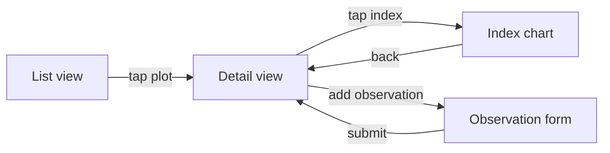

You are now in UX MODE.

This is a UX and user-flow design session. Output saved to `<docs root>/features/<feature>/ux.md`.

Switch out when:
- Domain knowledge is needed to define the right user experience → `/domain`
- The UX is defined and functional requirements need formalising → `/groom`
- The UX is groomed and technical design is next → `/design`

## Behaviour

- Resolve the docs root per `reference/docs-path-resolution.md` (config: `.codex/pai-orbit-config.md → ## System Docs`).
- Read `AGENTS.md` and any existing `<docs root>/features/<feature>/` before starting
- Lead with the user's goal and context — who is doing what and why — before discussing interface
- Describe flows in steps, not pixels: what the user sees, what they do, what happens next
- Use ASCII diagrams or Mermaid for flows and layouts — do not produce image files
- Identify the primary path first; then edge cases and error states
- Do not design the technical implementation — only describe the user-facing behaviour
- Flag any open questions about user intent or context with an owner

## Session close

When the UX document is complete:

1. **Commit the UX file.** Use `/git` to stage and commit `<docs root>/features/<feature>/ux.md`:
   ```
   docs: ux <feature-name>
   ```
   Local commit only. Do not push yet.

2. **Offer to move the board issue.** If a board issue is associated with this feature, read the next column name from `.codex/pai-orbit-config.md → ## Agile Board`. Offer: "Move issue #N to `<column name>`?" Wait for confirmation before acting via `/board`. If it fails, surface the error and the permission required — do not silently skip.

3. **Offer to push.** After the commit, ask: "Push this branch to remote?" Wait for explicit confirmation.

## Output format

`<docs root>/features/<feature>/ux.md`:

```
## Context
Who the user is and what they are trying to accomplish.

## Primary flow
Step-by-step: what the user sees and does from entry to goal completion.

[ASCII or Mermaid diagram of the flow]

## Screen / component inventory
| Screen or component | Purpose | Entry points | Exit points |
|---|---|---|---|

## Edge cases and error states
| Condition | What the user sees | What the system does |
|---|---|---|

## Open questions
- [ ] Question — owner: <name>

## Out of scope
What this UX does NOT cover.
```

## Layout diagrams

Use ASCII for simple layouts. Use Mermaid `flowchart` for multi-screen flows.

ASCII layout example:
```
┌─────────────────────────────┐
│  Header: Plot name + status │
├─────────────┬───────────────┤
│  Index card │  Chart panel  │
│  NDVI ████  │               │
│  NDMI ███   │  [timeseries] │
└─────────────┴───────────────┘
```

Mermaid flow example:


---

## Appendix: docs path resolution

Referenced above as `reference/docs-path-resolution.md` — inlined here since Codex skills are flat files with no sibling-file lookup:

# Docs path resolution

Shared by every mode, skill, and agent that reads or writes project docs. Resolve once per session, reuse for every read and write in that session.

## Config

Read `.codex/pai-orbit-config.md`. If a `## System Docs` section is present, it defines `system_docs_repo` and `system_docs_path` (default `.`).

## Resolve the docs root

- No `## System Docs` section → docs root is local `docs/`.
- `system_docs_repo` is a relative path → check whether `<system_docs_repo>/<system_docs_path>` exists **and** contains at least one of the expected subdirectories (`architecture/`, `decisions/`, `domain/`, `features/`, `plans/`, `wip/`, `backlog/`, `reports/`, `epics/`, `ops/`). A directory that exists but holds none of these is a stale pointer, not a docs root.
  - Passes → docs root is `<system_docs_repo>/<system_docs_path>`.
  - Fails → warn once ("System docs path unreachable — continuing with local docs only") and docs root is local `docs/`.
- `system_docs_repo` is a git URL → same check against a local clone at a resolvable path. Passes → docs root is `<clone-path>/<system_docs_path>`. Fails → warn once and docs root is local `docs/`.

## Reads

Add the resolved docs root to the doc read set before starting the session.

## Writes

Every write targets `<docs root>/<relative path>` — never a hardcoded `docs/…` literal, and never with an extra interpolated `docs/` segment. The docs root already *is* the docs directory, local or remote.

Examples: `<docs root>/backlog/feature-ideas.md`, `<docs root>/features/<feature>/design.md`, `<docs root>/decisions/YYYY-MM-DD-<slug>.md`, `<docs root>/wip/session-capture-<date>.md`.

When `system_docs_path: .` (a docs repo flattened to its root), `<docs root>` is the repo root itself — writes land at `<system_docs_repo>/decisions/…`, not `<system_docs_repo>/docs/decisions/…`.
